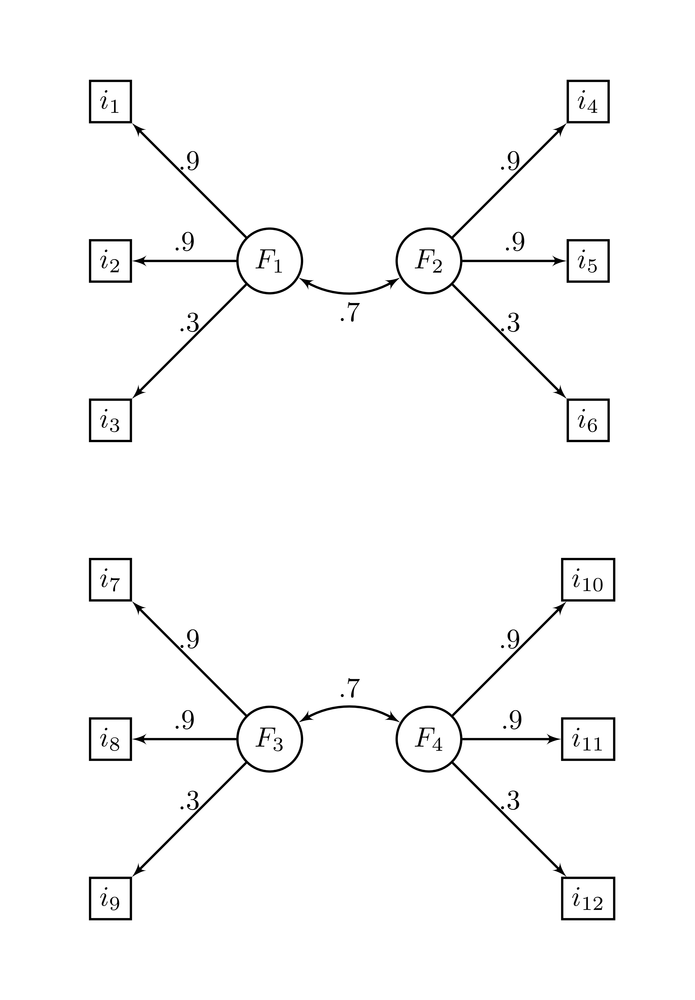

```{r setup, include = FALSE, warning=FALSE, comment = FALSE}
library(Rnest)
write_matex <- function(x) {
  begin <- "$$\\begin{bmatrix}"
  end <- "\\end{bmatrix}$$"
  X <-
    apply(x, 1, function(x) {
      paste(
        paste(x, collapse = "&"),
        "\\\\"
      )
    })
  writeLines(c(begin, X, end))
}
library(htmltools)
knitr::opts_chunk$set(
  fig.align = "center"
)
knitr::knit_hooks$set(imgcenter = function(before, options, envir){
  if (before) {
    HTML("<p align='center'>")
  } else {
    HTML("</p>")
  }
})
```

# Rnest: An R package for the Next Eigenvalue Sufficiency Test

The library `Rnest` offers the Next Eigenvalue Sufficiency Tests (NEST) [@Achim17; @Achim20] to determine the number of dimensions in exploratory factor analysis. It provides a main function `nest()` to carry the analysis and a `plot()` function.

There is also many examples of correlation matrices available with the packages and other stopping rules as well, such as `pa()` for parellel analysis.

# Installation

The development version can be accessed through GitHub:

```{r, echo = TRUE, eval = FALSE}
remotes::install_github(repo = "quanthmeth/Rnest")
library(Rnest)
```

# Examples

Here is an example using the `ex_4factors_corr` correlation matrix from the `Rnest` library. The factor structure is

```{r factstruct, echo = FALSE, out.height="50%", out.width="50%", imgcenter='center'}

```

and the correlation matrix is

```{r writecor, echo = FALSE, results='asis'}
write_matex(ex_4factors_corr)
```

From `ex_4factors_corr`, we can easily generate random data using the `MASS` packages [@MASS].

```{r gendata}
set.seed(1)
mydata <- MASS::mvrnorm(n = 2500,
                        mu = rep(0, ncol(ex_4factors_corr)),
                        Sigma = ex_4factors_corr)
```

We can then carry NEST.

```{r nest1}
nest(mydata)
```

We can visualize the results using the generic function `plot()`.

```{r plot, fig.cap="Scree plot of NEST", imgcenter='center'}
res <- nest(mydata)
plot(res)
```

The above figure shows the empirical eigenvalues in blue and the 95^th^ percentile of the sampled eigenvalues.

It is also possible to use a correlation matrix directly. A sample size, `n` must be supplied.

```{r nest2}
nest(ex_4factors_corr, n = 240)
```

The `nest()` function can use with many $\alpha$ values if desired.

```{r plot2, fig.cap="Scree plot of NEST with many $\\alpha$", imgcenter='center'}
res <- nest(ex_4factors_corr, n = 120, alpha = c(.01,.025,.05,.1))
plot(res)
```

# How to cite

Caron, P.-O. (2023). *Rnest: An R package for the Next Eigenvalue Sufficiency Test*. https://github.com/quantmeth/Rnest

# References
