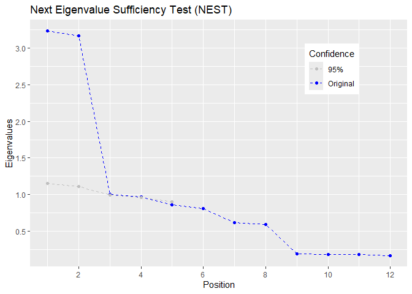
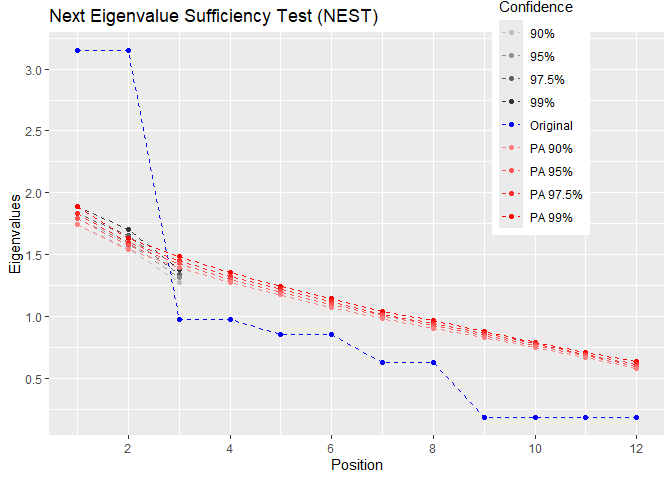

# Rnest: An R package for the Next Eigenvalue Sufficiency Test

The library `Rnest` offers the Next Eigenvalue Sufficiency Tests (NEST)
(Achim, 2017, 2020) to determine the number of dimensions in exploratory
factor analysis. It provides a main function `nest()` to carry the
analysis and a `plot()` function.

There is also many examples of correlation matrices available with the
packages and other stopping rules as well, such as `pa()` for parellel
analysis.

# Installation

The development version can be accessed through GitHub:

``` r
remotes::install_github(repo = "quantmeth/Rnest")
library(Rnest)
```

# Examples

Here is an example using the `ex_4factors_corr` correlation matrix from
the `Rnest` library. The factor structure is

<p align="center">

</p>

and the correlation matrix is

$$\begin{bmatrix}
1&0.81&0.27&0.567&0.567&0.189&0&0&0&0&0&0 \\
0.81&1&0.27&0.567&0.567&0.189&0&0&0&0&0&0 \\
0.27&0.27&1&0.189&0.189&0.063&0&0&0&0&0&0 \\
0.567&0.567&0.189&1&0.81&0.27&0&0&0&0&0&0 \\
0.567&0.567&0.189&0.81&1&0.27&0&0&0&0&0&0 \\
0.189&0.189&0.063&0.27&0.27&1&0&0&0&0&0&0 \\
0&0&0&0&0&0&1&0.81&0.27&0.567&0.567&0.189 \\
0&0&0&0&0&0&0.81&1&0.27&0.567&0.567&0.189 \\
0&0&0&0&0&0&0.27&0.27&1&0.189&0.189&0.063 \\
0&0&0&0&0&0&0.567&0.567&0.189&1&0.81&0.27 \\
0&0&0&0&0&0&0.567&0.567&0.189&0.81&1&0.27 \\
0&0&0&0&0&0&0.189&0.189&0.063&0.27&0.27&1 \\
\end{bmatrix}$$

From `ex_4factors_corr`, we can easily generate random data using the
`MASS` packages (Venables & Ripley, 2002).

``` r
set.seed(1)
mydata <- MASS::mvrnorm(n = 2500,
                        mu = rep(0, ncol(ex_4factors_corr)),
                        Sigma = ex_4factors_corr)
```

We can then carry NEST.

``` r
res <- nest(mydata)
res
```

    ## At 95% confidence, Nest Eigenvalue Sufficiency Test (NEST) suggests 4 factors.

The first output tells hom many factors NEST suggest. We can also
consult the summary with

``` r
summary(res)
```

    ## 
    ## nest 0.0.0.2 ended normally 
    ##  
    ##    Estimator                       ML 
    ##    Number of model parameters      66 
    ##    Resampling                      1000 
    ##    Sample size                     2500 
    ##    Stopped at                      5 
    ##  
    ##  
    ## Probabilities of factors 
    ##   Factor     Eigenvalue     Prob 
    ##     F1         3.228       < .001 
    ##     F2         3.167       < .001 
    ##     F3         1.007         .009 
    ##     F4         0.972         .009 
    ##     F5         0.860         .735 
    ## 
    ##  
    ## At 95% confidence, Nest Eigenvalue Sufficiency Test (NEST) suggests 4 factors. 
    ## Try plot(nest()) to see a graphical representation of the results. 
    ## 

We can visualize the results using the generic function `plot()` using
the `nest()` output.

<p align="center">

``` r
plot(res)
```

<div class="figure" style="text-align: center">


<p class="caption">
Scree plot of NEST
</p>

</div>

</p>

The above figure shows the empirical eigenvalues in blue and the
95<sup>th</sup> percentile of the sampled eigenvalues.

It is also possible to use a correlation matrix directly. A sample size,
`n` must be supplied.

``` r
nest(ex_4factors_corr, n = 240)
```

    ## At 95% confidence, Nest Eigenvalue Sufficiency Test (NEST) suggests 2 factors.

The `nest()` function can use with many $\alpha$ values if desired.

<p align="center">

``` r
res <- nest(ex_4factors_corr, n = 120, alpha = c(.01,.025,.05,.1))
plot(res)
```

<div class="figure" style="text-align: center">


<p class="caption">
Scree plot of NEST with many $\alpha$
</p>

</div>

</p>

# How to cite

Caron, P.-O. (2023). *Rnest: An R package for the Next Eigenvalue
Sufficiency Test*. <https://github.com/quantmeth/Rnest>

# References

<div id="refs" class="references csl-bib-body hanging-indent"
line-spacing="2">

<div id="ref-Achim17" class="csl-entry">

Achim, A. (2017). Testing the number of required dimensions in
exploratory factor analysis. *The Quantitative Methods for Psychology*,
*13*(1), 64–74. <https://doi.org/10.20982/tqmp.13.1.p064>

</div>

<div id="ref-Achim20" class="csl-entry">

Achim, A. (2020). Esprit et enjeux de l’analyse factorielle
exploratoire. *The Quantitative Methods for Psychology*, *16*(4),
213–247. <https://doi.org/10.20982/tqmp.16.4.p213>

</div>

<div id="ref-MASS" class="csl-entry">

Venables, W. N., & Ripley, B. D. (2002). *Modern applied statistics with
S*. Springer. <https://www.stats.ox.ac.uk/pub/MASS4/>

</div>

</div>
