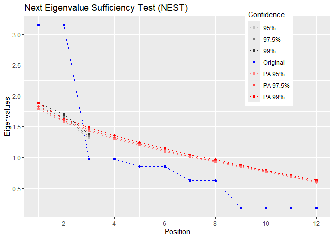
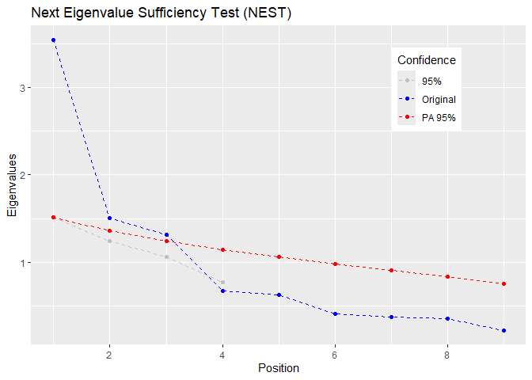

# Rnest: An R package for the Next Eigenvalue Sufficiency Test

The library `Rnest` offers the Next Eigenvalue Sufficiency Tests (NEST)
(Achim, 2017, 2020) to determine the number of dimensions in exploratory
factor analysis. It provides a main function `nest()` to carry the
analysis and a `plot()` function. It has been showed to amongst the best
stopping rule to determine the nuber of factor in factor analysis
(Achim, 2021; Brandenburg & Papenberg, 2024; Caron, 2025).

There is many examples of correlation matrices available with the
packages and other stopping rules as well, such as `pa()` for parallel
analysis or `MAP()` for minimum average partial correlation.

As of version `1.0`, `Rnest` is compatible with the `tidyverse` and the
`%>%`.

# Installation

The development version can be accessed through GitHub:

``` r
remotes::install_github(repo = "quantmeth/Rnest")
library(Rnest)
```

The CRAN package is also available.

``` r
installed.packages("Rnest")
library(Rnest)
```

# Examples

Here is an example using the `ex_4factors_corr` correlation matrix from
the `Rnest` library. The factor structure is

<p align="center">

</p>

and the correlation matrix is

$$\begin{bmatrix}
1&.810&.270&.567&.567&.189&&&&&& \\
.810&1&.270&.567&.567&.189&&&&&& \\
.270&.270&1&.189&.189&.063&&&&&& \\
.567&.567&.189&1&.810&.270&&&&&& \\
.567&.567&.189&.810&1&.270&&&&&& \\
.189&.189&.063&.270&.270&1&&&&&& \\
&&&&&&1&.810&.270&.567&.567&.189 \\
&&&&&&.810&1&.270&.567&.567&.189 \\
&&&&&&.270&.270&1&.189&.189&.063 \\
&&&&&&.567&.567&.189&1&.810&.270 \\
&&&&&&.567&.567&.189&.810&1&.270 \\
&&&&&&.189&.189&.063&.270&.270&1 \\
\end{bmatrix}$$

From `ex_4factors_corr`, we can easily generate random data using the
`MASS` packages (Venables & Ripley, 2002).

``` r
set.seed(1)
mydata <- MASS::mvrnorm(n = 2500,
                        mu = rep(0, ncol(ex_4factors_corr)),
                        Sigma = ex_4factors_corr)
```

We can then carry NEST.

``` r
res <- nest(mydata)
res
```

    ## At 95% confidence, Next Eigenvalue Sufficiency Test (NEST) suggests 4 factors.

The first output tells hom many factors NEST suggests. We can also
consult the summary with

``` r
summary(res)
```

    ## 
    ## nest 1.0 ended normally 
    ##  
    ##    Estimator                       ML 
    ##    Missing data treatment          FIML 
    ##    Number of model parameters      66 
    ##    Resampling                      1000 
    ##    Sample size                     2500 
    ##    Stopped at                      5 
    ##  
    ##  
    ## Probabilities of factors 
    ##   Factor     Eigenvalue     Prob 
    ##     F1         3.228       < .001 
    ##     F2         3.167       < .001 
    ##     F3         1.007         .010 
    ##     F4         0.972         .009 
    ##     F5         0.860         .727 
    ## 
    ##  
    ## At 95% confidence, Next Eigenvalue Sufficiency Test (NEST) suggests 4 factors. 
    ## Try plot(nest()) to see a graphical representation of the results. 
    ## 

We can visualize the results using the generic function `plot()` using
the `nest()` output.

<p align="center">

``` r
plot(res)
```

<div class="figure" style="text-align: center">


<p class="caption">
Scree plot of NEST
</p>

</div>

</p>

The above figure shows the empirical eigenvalues in blue and the
95<sup>th</sup> percentile of the sampled eigenvalues.

It is also possible to use a correlation matrix directly. A sample size,
`n` must be supplied.

``` r
nest(ex_4factors_corr, n = 240)
```

    ## At 95% confidence, Next Eigenvalue Sufficiency Test (NEST) suggests 2 factors.

The `nest()` function can use with many $\alpha$ values and presents
parallel analysis results if desired.

<p align="center">

``` r
res <- nest(ex_4factors_corr, n = 120, alpha = c(.01,.025,.05,.1))
plot(res, pa = TRUE)
```

<div class="figure" style="text-align: center">


<p class="caption">
Scree plot of NEST with many $\alpha$
</p>

</div>

</p>

# Recommended usage

Recommended usage : fiml estimation for correlation matrix and removing
unique variables.

``` r
library(dplyr)
ex_3factors_doub_unique %>%
  genr8(n = 200) %>%        # to generate simulated data for the example
  cor_nest() %>%  
  remove_unique() %>%       
  nest() %>% 
  plot(pa = TRUE)
```



# How to cite

Caron, P.-O. (2025). *Rnest: An R package for the Next Eigenvalue
Sufficiency Test*. <https://github.com/quantmeth/Rnest>

# References

<div id="refs" class="references csl-bib-body hanging-indent"
entry-spacing="0" line-spacing="2">

<div id="ref-Achim17" class="csl-entry">

Achim, A. (2017). Testing the number of required dimensions in
exploratory factor analysis. *The Quantitative Methods for Psychology*,
*13*(1), 64–74. <https://doi.org/10.20982/tqmp.13.1.p064>

</div>

<div id="ref-Achim20" class="csl-entry">

Achim, A. (2020). Esprit et enjeux de l’analyse factorielle
exploratoire. *The Quantitative Methods for Psychology*, *16*(4),
213–247. <https://doi.org/10.20982/tqmp.16.4.p213>

</div>

<div id="ref-Achim21" class="csl-entry">

Achim, A. (2021). Determining the number of factors using parallel
analysis and its recent variants: Comment on Lim and Jahng (2019).
*Psychological Methods*, *26*(1), 69–73.
<https://doi.org/10.1037/met0000269>

</div>

<div id="ref-Bran24" class="csl-entry">

Brandenburg, N., & Papenberg, M. (2024). Reassessment of innovative
methods to determine the number of factors: A simulation-based
comparison of exploratory graph analysis and next eigenvalue sufficiency
test. *Psychological Methods*, *29*(1), 21–47.
<https://doi.org/10.1037/met0000527>

</div>

<div id="ref-Caron25" class="csl-entry">

Caron, P.-O. (2025). A comparison of the next eigenvalue sufficiency
test to other stopping rules for the number of factors in factor
analysis. *Educational and Psychological Measurement*.
<https://doi.org/10.1177/00131644241308528>

</div>

<div id="ref-MASS" class="csl-entry">

Venables, W. N., & Ripley, B. D. (2002). *Modern applied statistics with
S*. Springer. <https://www.stats.ox.ac.uk/pub/MASS4/>

</div>

</div>
